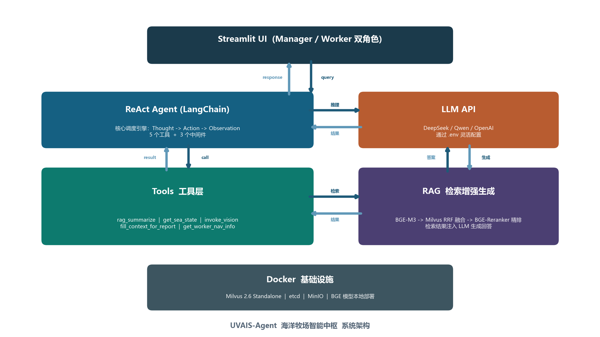
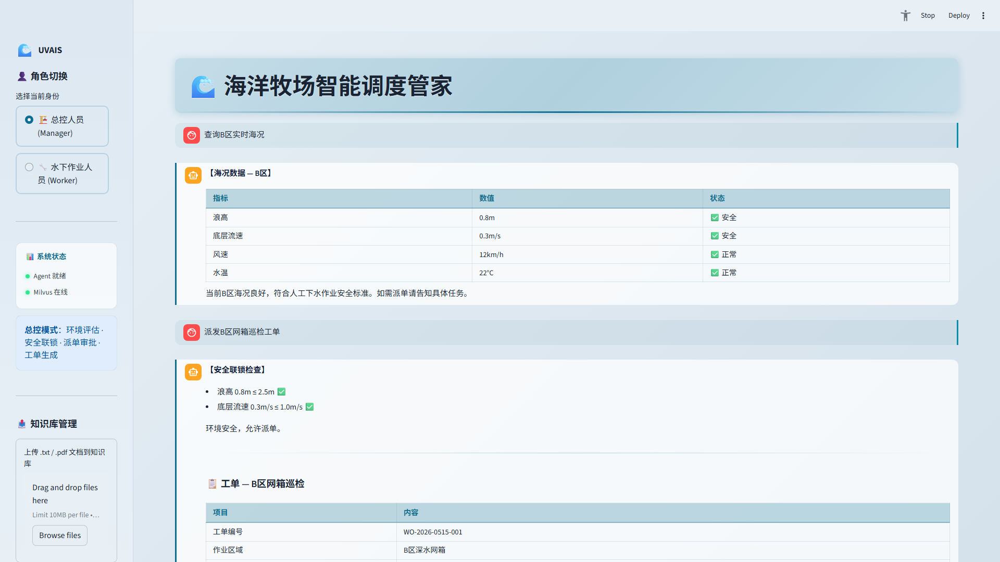
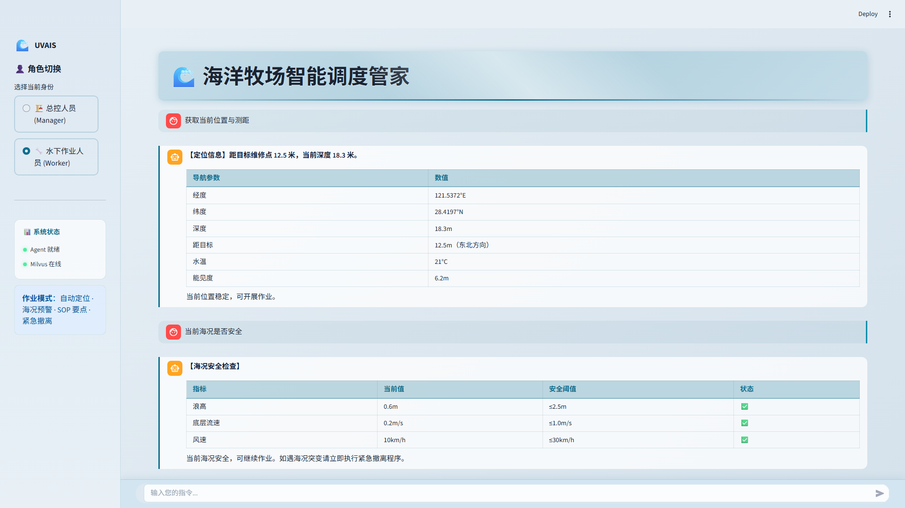

# UVAIS-Agent 海洋牧场智能中枢

基于 DeepSeek/Qwen 大模型的多角色 ReAct Agent，结合 RAG 知识库（Milvus + BGE-M3 + BGE-Reranker）实现海洋牧场智能巡检、安全评估与自动派单。

## 系统架构



## 界面展示

> 浅色海洋主题 · 自定义聊天气泡 · 角色欢迎屏 · 侧边栏状态指示

### 总控模式 (Manager)



| 区域 | 说明 |
|:---|:---|
| 顶部横幅 | 海洋牧场智能调度管家标题栏，浅蓝渐变底色 |
| 左侧边栏 | 角色切换 · 系统状态指示 · 知识库上传（Manager 专属） |
| 欢迎页 | 4 个快捷指令芯片（海况查询/派单/检测/报告） |
| 对话区 | 自定义聊天气泡，用户右侧青色边线，AI 左侧蓝色边线 |
| 底部输入栏 | 毛玻璃固定栏，始终吸附视口底部 |
| 工单下载 | AI 生成工单后自动出现 PDF 下载按钮 |

### 作业模式 (Worker)



| 区域 | 说明 |
|:---|:---|
| 顶部横幅 | 同 Manager |
| 左侧边栏 | 角色切换 · 系统状态指示 · 作业模式说明 |
| 欢迎页 | 4 个快捷指令芯片（定位/海况/SOP/视觉） |
| 对话区 | 同 Manager 气泡样式 |
| 底部输入栏 | 同 Manager |

> 使用 `?preview=manager` 或 `?preview=worker` 查询参数可预览带示例对话的界面。

## RAG 知识库管线

```
查询 → BGE-M3 稠密+稀疏混合检索 (Milvus)
     → RRF 融合 Top-20
     → BGE-Reranker Cross-Encoder 精排 Top-5
     → LLM 生成回答
```

知识库覆盖 5 类文档：SOP 操作规程、安全红线、视觉感知排障手册、灾害防治规范、历史告警案例库。

## 安全联锁

Manager 生成工单前强制检查，任一不满足即**拦截，工单不予生成**：

1. 必须已调用 `get_sea_state` 获取海况数据
2. 浪高 ≤ 2.5m 且 底层流速 ≤ 1.0m/s

海况数据缺失 → 默认拦截，安全优先。

## 快速启动

**环境要求：** Python 3.10+、Docker Desktop、DeepSeek API Key

### 1. 克隆并安装依赖

```bash
git clone <repo-url> && cd MyAgent
pip install -r requirements.txt
```

### 2. 下载 BGE 模型（首次）

```bash
# 安装 huggingface-cli
pip install huggingface_hub

# 下载 BGE-M3 嵌入模型
huggingface-cli download BAAI/bge-m3 --local-dir rag/huggingface/hub/models--BAAI--bge-m3/snapshots/5617a9f61b028005a4858fdac845db406aefb181

# 下载 BGE-Reranker 精排模型
huggingface-cli download BAAI/bge-reranker-base --local-dir rag/huggingface/hub/models--BAAI--bge-reranker-base/snapshots/2cfc18c9415c912f9d8155881c133215df768a70
```

> 模型路径与 `config/milvus.yml` 中配置一致，可按需修改。

### 3. 配置并启动

```bash
cp .env.example .env
# 编辑 .env，填入 LLM_API_KEY
```

**Windows 用户：** 双击 `start.bat` 一键完成（启动 Docker → 构建知识库 → 启动应用）

**手动启动：**

```bash
docker-compose up -d              # 启动 Milvus + etcd + MinIO
python rag/milvus_service.py      # 首次运行：构建知识库
streamlit run app.py              # 启动应用
```

打开 `http://localhost:8501`，左侧边栏选择角色即可开始。

### 自定义大模型

编辑 `.env` 文件即可切换任意 OpenAI 兼容 API（DeepSeek / Qwen / OpenAI / 本地模型等）：

```bash
LLM_API_KEY=your_api_key          # API Key
LLM_API_BASE=https://api.example.com/v1   # API 地址
LLM_MODEL_NAME=your-model-name    # 模型名称
```

## 工具清单

| 工具 | 角色 | 说明 |
|------|------|------|
| `rag_summarize` | 全员 | 向量知识库 SOP 检索与总结 |
| `get_sea_state` | 全员 | 实时海况（浪高/流速/风速/水温）+ 安全判定 |
| `invoke_vision_model` | 全员 | SEAD-YOLO 视觉检测（海星/海胆/网衣破损） |
| `get_worker_nav_info` | Worker | 自动 3D 定位测距 |
| `fill_context_for_report` | Manager | 上下文注入 + 安全联锁拦截 + PDF 工单生成 |

## 项目结构

```
MyAgent/
├── app.py                    # Streamlit 入口 + 全部 UI 样式
├── start.bat                 # Windows 一键启动脚本
├── requirements.txt          # Python 依赖清单
├── docker-compose.yml        # Milvus + etcd + MinIO
├── .env.example              # 环境变量模板
├── .streamlit/
│   └── config.toml           # Streamlit 浅色主题配置
├── agent/
│   ├── react_agent.py        # ReAct Agent（LangChain）
│   └── tools/
│       ├── agent_tools.py    # 5 个工具定义
│       └── middleware.py     # 工具监控 + 动态提示词切换
├── rag/
│   ├── milvus_service.py     # Milvus 混合向量库（BGE-M3）
│   ├── summarize_service.py  # RAG 检索 + LLM 总结
│   └── reranker_service.py   # BGE-Reranker Cross-Encoder 精排
├── prompts/                  # 系统 & 工单 & RAG 提示词模板
│   ├── main_prompt.txt
│   ├── workorder_prompt.txt
│   └── rag_summarize.txt
├── config/                   # YAML 配置文件
│   ├── milvus.yml
│   ├── rag.yml
│   └── prompts.yml
├── data/                     # 知识库源文档（.txt）
├── utils/
│   ├── prompt_loader.py      # 提示词加载
│   ├── pdf_export.py         # Markdown → PDF 导出
│   ├── logger_handler.py     # 日志
│   ├── config_handler.py     # 配置解析
│   ├── path_tool.py          # 路径工具
│   └── file_handler.py       # 文件处理
├── model/
│   └── factory.py            # LLM 模型工厂
├── tests/
│   └── test_rag_eval.py      # RAG 检索质量评估
└── assets/
    ├── architecture.png      # 系统架构图
    ├── manager_demo.png      # Manager 界面截图
    └── worker_demo.png       # Worker 界面截图
```

## 技术栈

| 层级 | 技术 |
|:---|:---|
| Agent 框架 | LangChain (ReAct) |
| 大模型 | DeepSeek-chat / Qwen-max (OpenAI 兼容 API) |
| 向量数据库 | Milvus 2.6 Standalone |
| 嵌入模型 | BGE-M3 (Dense + Sparse 混合) |
| 精排模型 | BGE-Reranker Base (Cross-Encoder) |
| 前端 | Streamlit 1.x |
| 基础设施 | Docker, etcd, MinIO |
| PDF 导出 | fpdf2 (Markdown → PDF) |

## License

MIT
