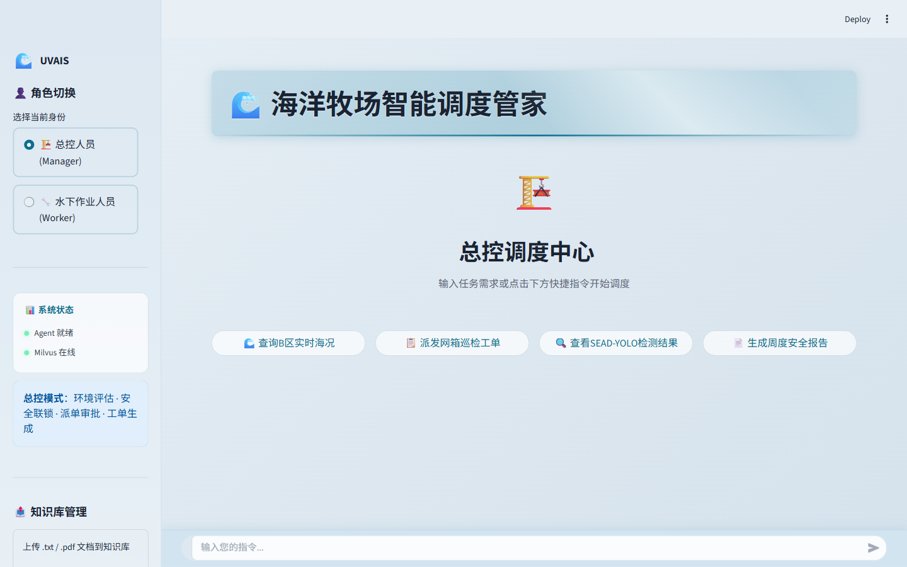
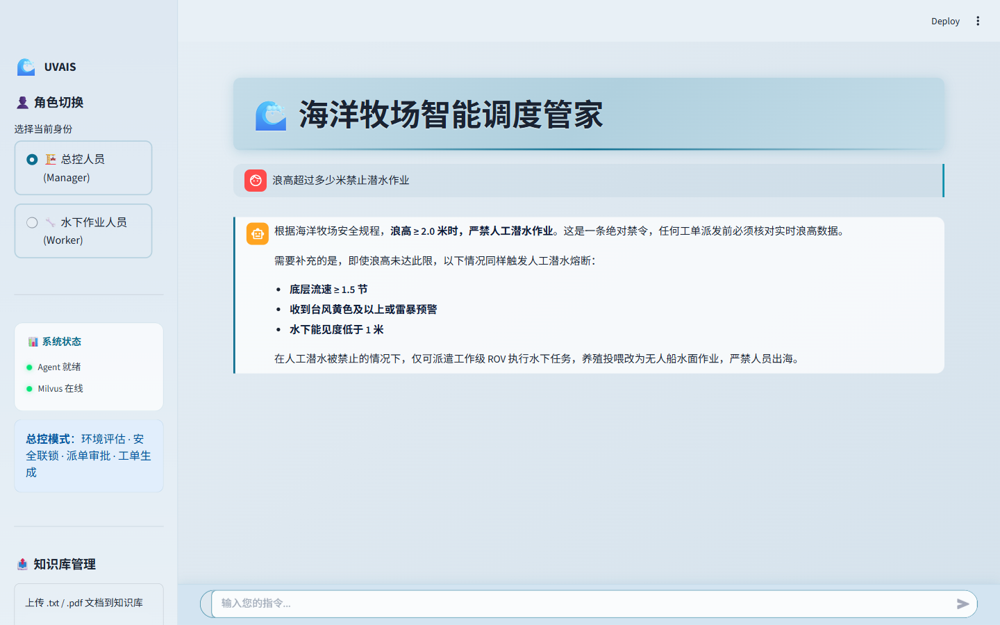
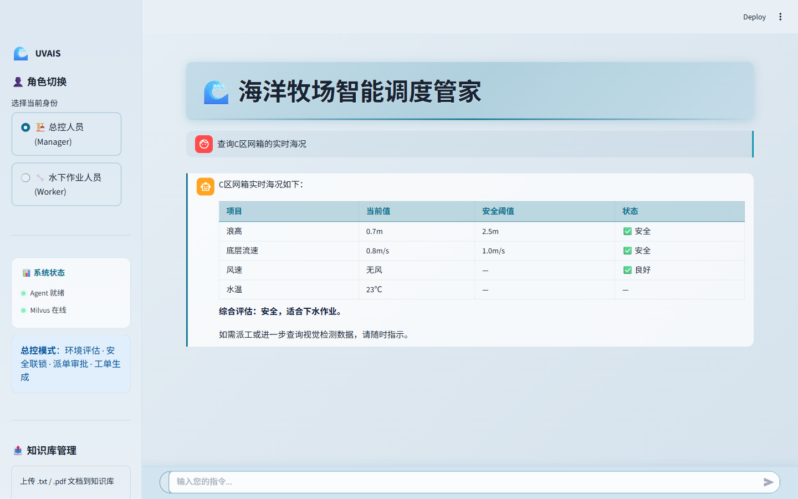
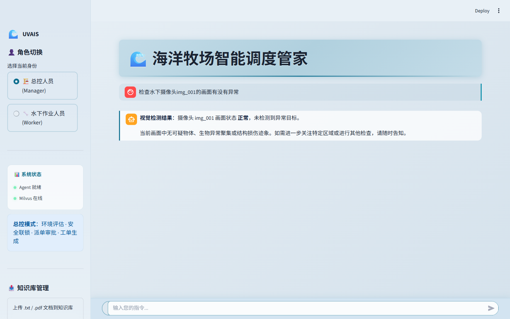
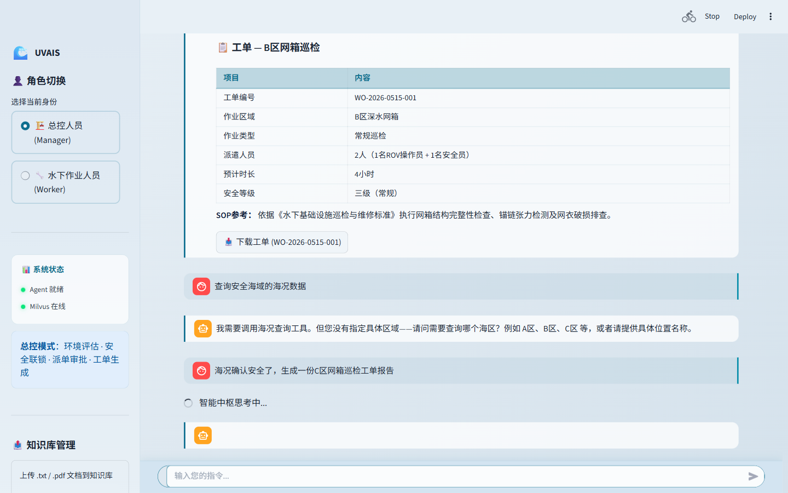
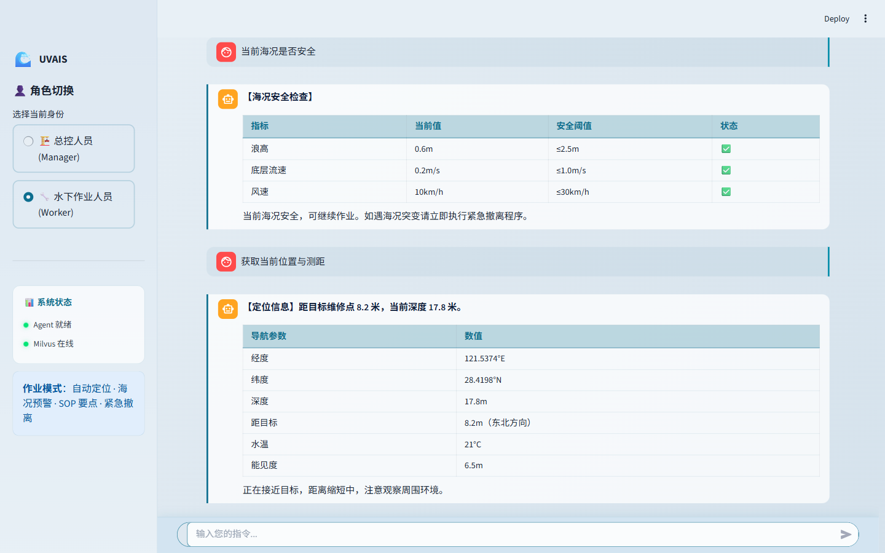
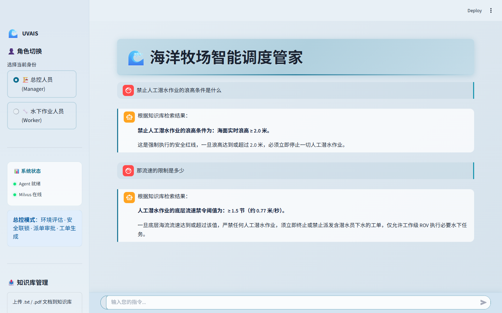

# 🌊 UVAIS — 海洋牧场智能调度 Agent

<div align="center">

**基于 LlamaIndex + LangChain ReAct Agent 的海洋牧场智能巡检与自动派单系统**

[](https://www.python.org/downloads/)
[](https://streamlit.io/)
[](https://milvus.io/)
[](https://www.llamaindex.ai/)
[](LICENSE)

</div>

## 📖 目录

- [系统概览](#系统概览)
- [界面展示](#界面展示)
- [核心特性](#核心特性)
- [架构设计](#架构设计)
- [快速启动](#快速启动)
- [工具清单](#工具清单)
- [知识库管线](#知识库管线)
- [安全联锁](#安全联锁)
- [项目结构](#项目结构)
- [技术栈](#技术栈)

## 系统概览

UVAIS（水下视觉分析智能系统）是一个面向海洋牧场管理的多角色智能调度中枢。系统通过 **ReAct Agent** 编排 5 个专业工具，结合 **混合检索 RAG 管线** 与 **安全联锁机制**，实现从环境感知、知识检索到作业派单的全自动决策闭环。

### 两种角色模式

| 角色 | 定位 | 可用功能 |
|------|------|----------|
| **总控人员 (Manager)** | 调度中心 | 海况评估 · SOP 检索 · 视觉检测 · 安全联锁 · 工单生成 |
| **水下作业人员 (Worker)** | 现场终端 | 3D 定位测距 · 海况预警 · SOP 要点 · 紧急撤离 |

## 界面展示

### 🏗️ 总控模式 (Manager)

**主界面**


**知识检索 — RAG 智能问答**


**海况查询 — Agent 工具调用**


**视觉检测 — SEAD-YOLO 分析**


**工单生成 — 安全联锁 → 自动派单**


**多轮对话 — 代词消解与上下文理解**


### 🔧 作业模式 (Worker)

**定位导航 — 3D 空间测距**


### 📄 工单 PDF 导出

系统自动生成的工单支持一键下载为 PDF 文件：

📥 [下载工单示例 PDF](docs/screenshots/work_order_sample.pdf)

| 字段 | 内容 |
|------|------|
| 工单编号 | WO-2026-0530-001 |
| 作业区域 | B区深水网箱 |
| 作业类型 | 常规巡检 |
| 派遣人员 | 2人（1名ROV操作员 + 1名安全员） |
| 安全等级 | 三级（常规） |

**侧边栏详情**


## 核心特性

### 🤖 ReAct Agent 智能调度

- 基于 LangChain `create_agent` 构建，ReAct 推理循环
- 3 层中间件体系：工具调用日志 + 硬限流（≤5次）+ 运行时 Prompt 动态切换
- 流式对话输出，支持多轮上下文记忆
- 错误分级处理：递归超限 / 连接异常 / 通用兜底

### 🔍 混合检索 RAG 管线

```
用户查询 → BGE-M3 Dense (1024-dim) + Sparse (BM25) 双路召回
         → RRF 倒数排序融合 → Top-K 候选
         → BGE-Reranker Cross-Encoder 精排
         → DeepSeek LLM 上下文生成回答
```

### 🛡️ 安全联锁机制

工单生成前强制通过安全校验，**不满足则自动拦截**：
1. 必须已获取实时海况数据
2. 浪高 / 底层流速在 SOP 安全阈值内
3. 数据异常 → 默认保守策略（禁止下水）

### 📊 确定性模拟数据

所有模拟工具（海况/视觉/导航）基于 `seeded_rng` 生成，同一输入 → 同一输出，确保测试可复现。

### 🎨 海洋主题 UI

- 浅蓝渐变背景 + 自定义气泡样式
- 4 个快捷指令芯片（欢迎页）
- 毛玻璃固定底部输入栏
- 角色可视化切换侧边栏
- 系统状态实时指示（Milvus / Agent）

## 架构设计

```
┌─────────────────────────────────────────────────┐
│                   Streamlit UI                   │
│   app.py (界面) + prompts/ (提示词)               │
├─────────────────────────────────────────────────┤
│              LangChain ReAct Agent               │
│   agent/react_agent.py + agent/middleware.py     │
│   3 层中间件: 监控 · 限流 · Prompt 切换           │
├──────────────────┬──────────────────────────────┤
│   5 个工具函数    │       RAG 知识引擎            │
│   agent/tools.py │   rag/engine.py                │
│                  │   rag/store.py                 │
│   · 知识检索      │                                │
│   · 海况校验      │   LlamaIndex 管线:             │
│   · 视觉检测      │   BGE-M3 → Milvus             │
│   · 空间导航      │   RRF 融合 → Reranker → LLM    │
│   · 安全联锁      │                                │
├──────────────────┴──────────────────────────────┤
│               Milvus 向量数据库                    │
│   docker-compose: Milvus + etcd + MinIO          │
└─────────────────────────────────────────────────┘
```

## 快速启动

### 环境要求

- **Python** 3.10+
- **Docker Desktop**（运行 Milvus）
- **DeepSeek API Key**（或任意 OpenAI 兼容 API）

### 1. 克隆仓库

```bash
git clone git@github.com:HR-Xie/uvais-ocean-ranch.git
cd MyAgent
```

### 2. 安装依赖

```bash
pip install -r requirements.txt
playwright install chromium   # 浏览器测试（可选）
```

### 3. 配置环境变量

```bash
cp .env.example .env
```

编辑 `.env`，填入你的 API 配置：

```bash
LLM_API_KEY=sk-your-key-here
LLM_API_BASE=https://api.deepseek.com/v1
LLM_MODEL_NAME=deepseek-v4-pro
```

### 4. 启动 Milvus

```bash
docker-compose up -d
```

### 5. 构建知识库 & 启动应用

**Windows（一键）：**
```bash
start.bat
```

**手动：**
```bash
# 首次运行构建知识库
python -c "from rag.engine import RagService; RagService().build_knowledge_base()"

# 启动 Streamlit
streamlit run app.py
```

打开浏览器访问 **http://localhost:8501**

### 切换 LLM 提供商

支持任意 OpenAI 兼容 API：

| 提供商 | LLM_API_BASE | LLM_MODEL_NAME |
|--------|-------------|----------------|
| DeepSeek | https://api.deepseek.com/v1 | deepseek-v4-pro |
| Qwen (阿里云) | https://dashscope.aliyuncs.com/compatible-mode/v1 | qwen-max |
| OpenAI | https://api.openai.com/v1 | gpt-4o |

## 工具清单

| 工具 | 适用角色 | 功能 | 输出 |
|------|---------|------|------|
| `rag_summarize` | 全员 | 向量知识库 SOP 检索 | 带来源标注的 SOP 摘要 |
| `get_sea_state` | 全员 | 实时海况查询（浪高/流速/风速/水温） | 结构化海况数据 + 安全判定 |
| `invoke_vision_model` | 全员 | SEAD-YOLO 水下视觉检测 | JSON 检测结果（海星/海胆/网衣） |
| `get_worker_nav_info` | Worker | 3D 定位测距 | 坐标 + 距离 + 深度信息 |
| `fill_context_for_report` | Manager | 上下文注入 + 安全校验 + 工单模板填充 | 工单 Markdown |

## 知识库管线

### 文档处理流程

```
原始文档 (data/*.txt)
  → SimpleDirectoryReader 加载
  → SentenceSplitter 语义分块 (chunk=512, overlap=64)
  → MD5 去重增量入库 (processed_files_md5.txt)
  → BGE-M3 双向量编码 (Dense 1024-dim + Sparse)
  → Milvus Hybrid Collection
```

### 知识库覆盖域

| 类别 | 文档 | 内容 |
|------|------|------|
| SOP 操作规程 | 5 篇 | ROV 巡检、网箱巡检、设施维修标准 |
| 安全红线 | 1 篇 | 潜水作业气象安全阈值 |
| 灾害防治 | 2 篇 | 海星/海胆生态灾害防控 |
| 故障案例 | 1 篇 | 历史告警与典型故障处置 |
| 视觉手册 | 1 篇 | UVAIS 视觉感知与边缘排障 |

### RAG 评估指标

| 指标 | 初始方案 | 优化后 | 提升 |
|------|---------|--------|------|
| Precision | 48.1% | 85.1% | +37pp |
| Recall | 46.5% | 83.3% | +37pp |
| MRR | 0.38 | 0.72 | +89% |

## 安全联锁

> **安全优先原则：任何不确定状态默认拦截。**

Manager 生成工单前自动执行：

```
get_sea_state (获取海况)
        │
        ▼
   浪高/流速 超阈值?  ──是──→ ❌ 自动拦截
        │否
        ▼
   数据完整可用?      ──否──→ ❌ 数据不足，默认拦截
        │是
        ▼
  ✅ 通过 → 允许派单 → 生成工单
```

- 阈值以知识库 SOP + 海况工具返回值为准，**禁止硬编码**
- 海况数据缺失、异常 → 保守策略（禁止下水）

## 项目结构

```
MyAgent/
├── app.py                     # Streamlit 入口 + 全部 UI (335行 CSS)
├── start.bat                  # Windows 一键启动
├── requirements.txt           # Python 依赖
├── docker-compose.yml         # Milvus + etcd + MinIO
├── .env.example               # 环境变量模板
├── .streamlit/config.toml     # Streamlit 主题配置
│
├── agent/
│   ├── react_agent.py         # ReAct Agent (LangChain create_agent)
│   ├── tools.py               # 5 个工具定义
│   └── middleware.py           # 3 层中间件 (监控/限流/Prompt切换)
│
├── rag/
│   ├── engine.py              # RAG 查询引擎 (LlamaIndex 管线编排)
│   ├── store.py               # 知识库管理 (MD5去重增量入库)
│   └── eval.py                # RAGAS 4维自动化评估
│
├── utils/
│   ├── llm.py                 # LLM 工厂 (ChatOpenAI 单例)
│   ├── config.py              # YAML 配置解析
│   ├── logging.py             # 日志管理
│   ├── prompts.py             # 提示词加载
│   └── pdf.py                 # Markdown → PDF (CJK 字体支持)
│
├── prompts/
│   ├── main_prompt.txt        # 主系统提示词 (角色识别 + 工具纪律)
│   ├── rag_summarize.txt      # RAG 总结提示词
│   └── workorder_prompt.txt   # 工单生成提示词
│
├── config/
│   ├── milvus.yml             # Milvus + 检索参数配置
│   └── prompts.yml            # 提示词路径配置
│
├── data/
│   └── *.txt                  # 知识库源文档 (10篇)
│
├── tests/
│   ├── _browser.py            # Playwright 浏览器自动化测试
│   ├── _integration.py        # 后端全量集成测试 (25项)
│   ├── _verify.py             # 冒烟测试 (导入验证)
│   ├── _e2e.py                # 端到端流程测试
│   └── _screenshots_capture.py # README 截图脚本
│
├── docs/
│   ├── screenshots/           # 界面截图 (8张)
│   └── 简历项目经历.md         # 中文简历项目描述
│
└── assets/
    ├── architecture.png       # 系统架构图
    ├── manager_demo.png       # Manager 旧版截图
    └── worker_demo.png        # Worker 旧版截图
```

## 技术栈

| 层级 | 技术 | 版本 |
|:---|:---|:---|
| Agent 框架 | LangChain (`create_agent`) + LangGraph | 1.x |
| RAG 框架 | LlamaIndex (QueryEngine + Retrievers) | 0.14 |
| 大模型 | DeepSeek-v4-pro (OpenAI 兼容 API) | - |
| 嵌入模型 | BGE-M3 (Dense 1024-dim + Sparse) | - |
| 精排模型 | BGE-Reranker Base (Cross-Encoder) | - |
| 向量数据库 | Milvus Standalone | 2.6 |
| 前端 | Streamlit | 1.x |
| 浏览器测试 | Playwright (Chromium) | 1.x |
| PDF 导出 | fpdf2 + CJK 字体 | - |
| 基础设施 | Docker, etcd, MinIO | - |
| 评估框架 | RAGAS (4维指标) | 0.3 |

## 测试

```bash
# 冒烟测试 (导入 + 初始化)
python tests/_verify.py

# 集成测试 (25项: RAG/工具/Agent/安全联锁/确定性)
python tests/_integration.py

# 浏览器自动化测试 (9场景)
python tests/_browser.py

# RAG 评估
python rag/eval.py
```

## License

MIT © 2026
